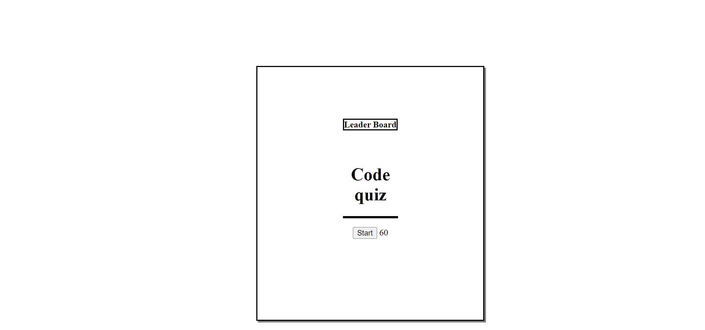

# jsQuiz

## Description

This quiz webpage will allow a user to start a quiz that will initiate when the user press the start button and will direct them to a quiz question. Once the user answer this question, it will direct the user to the next question and this process will repeat until the user go through all the quiz questions. Once the user finishes the quiz, they will be able to log their initials in to save their score. Afterwards the quiz should direct them to a high score page that will have their most recent attempt of the quiz shown along with their initials. Finally, the user can use the quiz button to go back to the initial starting screen. 

## Usage
The JavaScript Quiz can be accessed through here: https://drog41813.github.io/passWord-generation3/ 

## Credits
The following site assisted in basic and general JS concepts as well as how to operate JS itself using various methods and syntax: https://www.w3schools.com/js/js_syntax.asp
The following individual's github profile indicates partnership in regards to working together and collaborating/sharing constructive ideas with the password generator webpage: https://github.com/micavilla
The following individual's github profile indicates partnership in regards to working together and collaborating/sharing constructive ideas with the password generator webpage: https://github.com/LucasWyski001

## License
MIT License

Copyright (c) 2023 drog41813

Permission is hereby granted, free of charge, to any person obtaining a copy
of this software and associated documentation files (the "Software"), to deal
in the Software without restriction, including without limitation the rights
to use, copy, modify, merge, publish, distribute, sublicense, and/or sell
copies of the Software, and to permit persons to whom the Software is
furnished to do so, subject to the following conditions:

The above copyright notice and this permission notice shall be included in all
copies or substantial portions of the Software.

THE SOFTWARE IS PROVIDED "AS IS", WITHOUT WARRANTY OF ANY KIND, EXPRESS OR
IMPLIED, INCLUDING BUT NOT LIMITED TO THE WARRANTIES OF MERCHANTABILITY,
FITNESS FOR A PARTICULAR PURPOSE AND NONINFRINGEMENT. IN NO EVENT SHALL THE
AUTHORS OR COPYRIGHT HOLDERS BE LIABLE FOR ANY CLAIM, DAMAGES OR OTHER
LIABILITY, WHETHER IN AN ACTION OF CONTRACT, TORT OR OTHERWISE, ARISING FROM,
OUT OF OR IN CONNECTION WITH THE SOFTWARE OR THE USE OR OTHER DEALINGS IN THE
SOFTWARE.